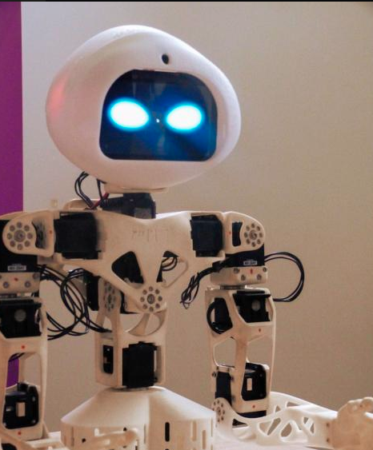

# Poppy-eve-head-design

Raspberry Pi 4-based head design for Poppy Torso and Humanoid ; embedding a screen:

This repository contains:

* `doc`: the documentation files on the Poppy Eve head
* `hardware`
  * `STL` : the directory with the STL files to print the head parts
  * `BOM.md`: the bill of material
* `software`
  * `RPi_config`: contains the file ` config.txt` with the instruction tu use the DSI connector of the RPI4 to connect the display
  * `blinking_eyes`: files to make Poppy's eye blink using a processing program.
