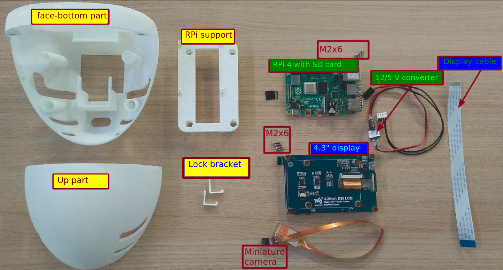
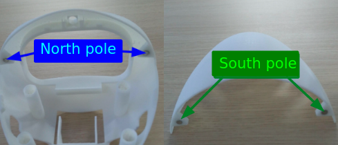
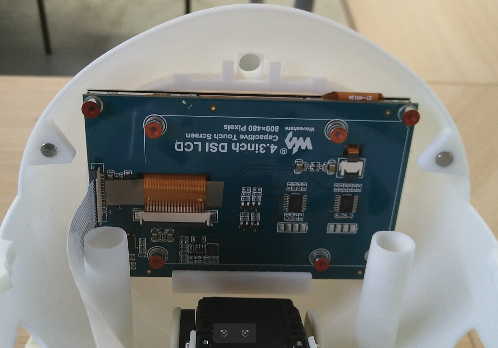

# Eva-Head  assembly procedure

With [this bill of materials](../hardware/BOM.md), you should have all this material on the work bench:

## 1 - Preparing the head parts

Insert the miniature button magnets in the holes provided for this purpose in the _bottom/face_ and _upper_ parts.

WARNING: be careful with the magnet orientation while inserting them. __north__ and __south__ poles attract each other ensuring magnetic attraction between the the _up_ and _face-bottom_ parts, while __north__/__north__ or __south__/__south__ repel each other !

## 2 - Fix the "bottom-face part" of the head to the AX-12 motor

- Insert the 8 x _M2 nuts_ in the reserved slots on the carter of the AX-12 motor

- Engage the "bottom-face part" of the head to align its fixing holes with those of the housing of the AX-12 motor.

- Gently tighten the 8 _M2x6_ screws:

## 3 - Preparing and installing the LCD display

- Gently pull the extremities of the _black lock bar_ of the DSI connector to open the connector.

- Insert the display cable with the contacts side of the cable oriented as shown in the image.
  
- Gently push the extremities of the _black lock bar_  to lock the cable inside the connector.

When done, engage the screen in the "bottom-face part" of the head and lock the display with the the help of "removable glue pads" (_yellow patafix_) with the 2 _lock sliders_ :

 

## 4 - Fixing the camera in the head 

Insert the camera in the hole in the "bottom-face part" of the head:

## 5 - Preparing the RPi module

- You must flash the SD card to install a Linux distribution and the Poppy software: follow this [guide](https://github.com/poppy-project/poppy-docs/blob/master/en/installation/burn-an-image-file.md#download-the-image). Then you can insert the SD card in the SD slot of the RPi module.

- Place the RPi module on the "RPi support" part as shown in the image and gently tighten the 4 x M2x6 screws:

 

- When done, you can place the RPi support in the "bottom-face part" of the head, with the GPIO connector at the raer of the head.

## 6 - Final steps

- Connect the camera cable to the camera connector of the RPi module as shown in the image, with the contacts side of the cable facing the connector contacts (same gentle operation as in step 3).

 

- Connect the display cable to the RPi display connector as shown in the image, with contact side of the cable facing the connector contacts.
  
- Connect the power connector to the GPIO connector of the RPi module as shown in the image.

- Connect the USB2AXB to the USB port of the RPi module:
  
 

Et Voilà :smirk:

Close the head with the "upper part" : the Poppy _Eva head_ is ready ....

