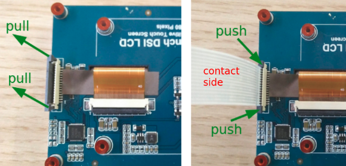
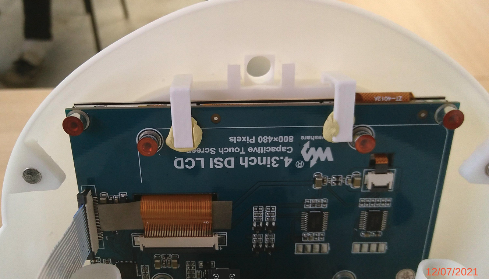

# Eve-Head  assembly procedure

With [this bill of matérials](../hardware/BOM.md), you should have all this material on the work bench:

## 1 - Preparing the head parts

Insert the miniature button magnets in the holes provided for this purpose in the _bottom/face_ and _upper_ parts.
WARNING: you must take care to respect the __north__/__south__ faces of the magnets to ensure the fixation of the _upper_ part on the _bottom/face_ part.

## 2 - Fix the bottom/face part to the AX-12 motor

- Insert the 8 _M2 nuts_ in the reserved slots on the carter of the AX-12 motor

- Engage the _bottom/face_ part to align its fixing holes with those of the housing of the AX-12 motor.

- Gently tighten the eight screws _M2x6_:

## 3 - Preparing and installing the LCD display

- Gently pull the extremities of _black lock bar_ of the DSI connector to open the connector.

- Insert the display cable with the contacts side of the cable oriented as shown in the image.
  
- Gently push on the the extremities of _black lock bar_  to lock the cable inside the connector.

When done, engage the screen in its location in the bottom/face part; and lock the display withe the help of patafix and the 2 _lock _ :

 

