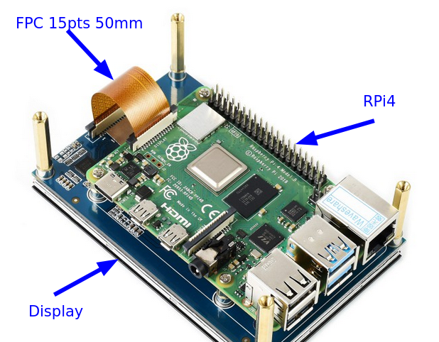

for the head eve, you will need the following material:

## 1/ Display: 4.3inch Capacitive Touch Display for Raspberry Pi, DSI Interface, 800×480
We have selected [this display](https://www.waveshare.com/product/raspberry-pi/displays/lcd-oled/4.3inch-dsi-lcd.htm?):
- it is compatible with the DSI display interface of the Rapsberry Pi
- it has a resolution of 800x400 with touch control
- it is relatively cheap (~ 40$ or 36€).

The RPi can be fixed to the display and connected with the FPC 15PIN (Flexible Printed Circuits, opposite sides) of 50 mm length:

! 
)

## 2/ Miniature camera: 

