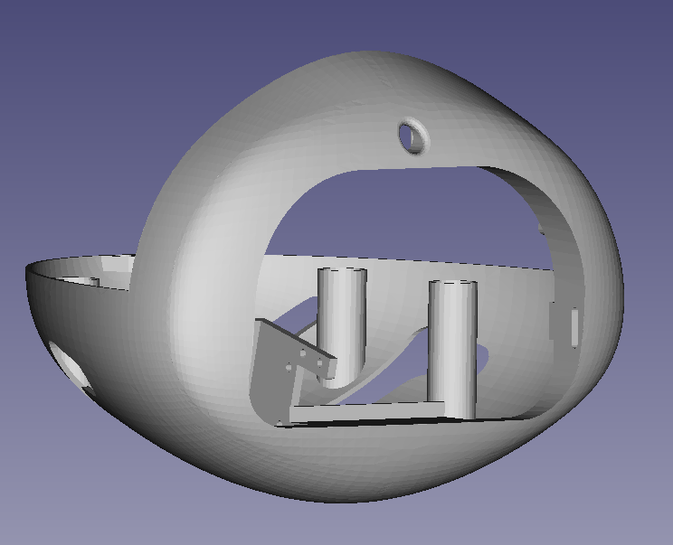
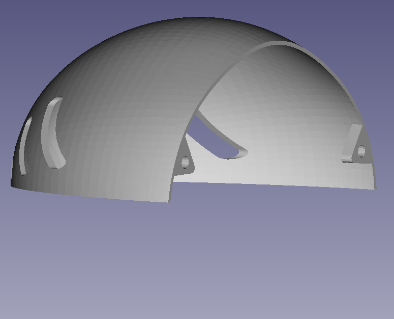
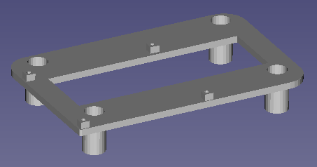
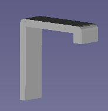

# BOM

For the head _eve_, you will need the following material:

|  id   | description                                                  | quantity |
| :---: | :----------------------------------------------------------- | :------: |
|   1   | Raspberry Pi 4 module with its SD card                       |    1     |
|  2.1  | 3.4 inch display 800x400                                     |    1     |
|  2.2  | 15 cm FPC 15PIN (Flexible Printed Circuits, opposite sides) cable to connect the display to the DSI connector of the RPi |    1     |
|   3   | Miniature RPi camera B0066                                   |    1     |
|   4   | Miniature button magnets                                     |    6     |
|  5.1  | Head front-bottom part (3D printed)                          |    1     |
|  5.2  | Head top part (3D printed)                                   |    1     |
|  5.3  | Head RPi 4 support (3D printed)                              |    1     |
|  5.4  | Locking brackets (3D printed) to lock the display inside the head                             |    2     |
|   6   | M2x6 screw                                                   |    16    |
|  7  | Patafix to maintain the locking brackets on the dispay.    |    2     |

## 1/ Raspberry Pi 4 module

You need a RPi4 module, with at least 2 GB RAM and a 16 GB SD card.

## 2/ 4.3inch Capacitive Touch Display for Raspberry Pi, DSI Interface, 800×480

We have selected [this display](https://www.waveshare.com/product/raspberry-pi/displays/lcd-oled/4.3inch-dsi-lcd.htm?):

- it is compatible with the DSI display interface of the Raspberry Pi
- it has a resolution of 800x400 with touch control
- it is relatively cheap (~ 40 $ or 36 €).

As shown on the image, the RPi module can be attached directly to the back of the display, but for the Poppy usage, the display will be connected to the RPI  DSI connector using the 15 cm long FPC 15PIN (Flexible Printed Circuits, opposite sides).

Available for example at [www.waveshare.com](https://www.waveshare.com/product/raspberry-pi/displays/lcd-oled/4.3inch-dsi-lcd.htm?).

## 3/ Miniature camera 5 Mpx B0066

We have choosen [this model](https://www.arducam.com/spy-camera-raspberry-pi/) for its very small size and good technical characteristics:

~ 35 € available for example at [www.generationrobots.com](https://www.generationrobots.com/en/402341-spy-camera-for-raspberry-pi.html), 
[www.gotronic.fr](https://www.gotronic.fr/art-module-camera-miniature-5-mpx-b0066-25255.htm) or [www.lextronic.fr](https://www.lextronic.fr/module-camera-spy-camera-5-mpx-pour-raspberry-pi-39137.html).

## 4/ Miniature button magnets

The button magnets are used for assembling the 2 parts of the head.
Dimensions:

- diameter: 6 mm
- thickness: 2.75 mm
  
Available for example at ????

## 5/ STL parts

- 2 parts fixed with miniature magnets :
  - the front/bottom part: 
`eve_head_frontBottom-part.stl` 

  
  - the top part: 
`eve_head_top-part.stl` 

- the RPi4 support inserted in the frontBottom part: 
`eve_head_RPI4Support-part.stl` 

  
- the "locking bracket" part to lock the display inside the head: 
`eve_head_lock-part.stl` 

