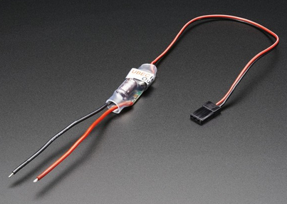
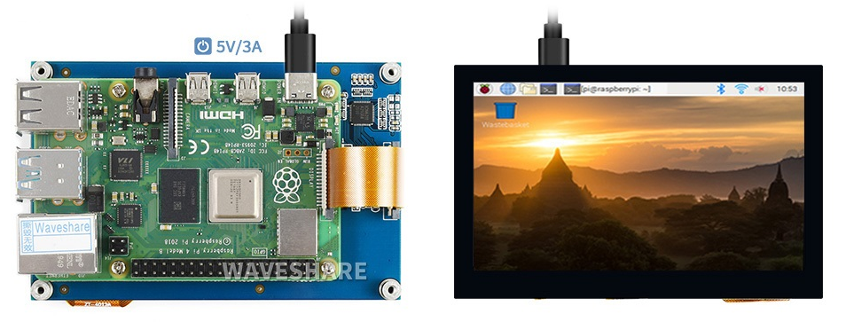
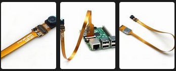
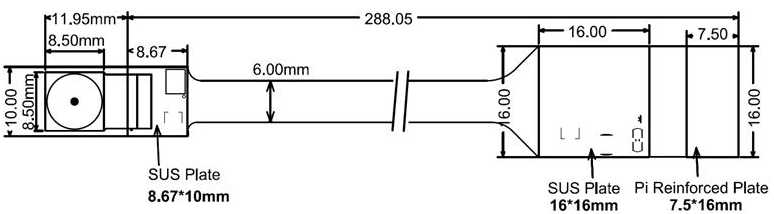
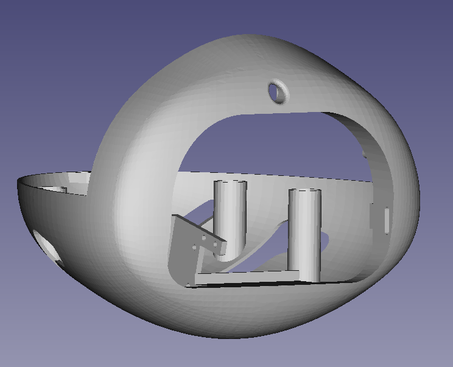
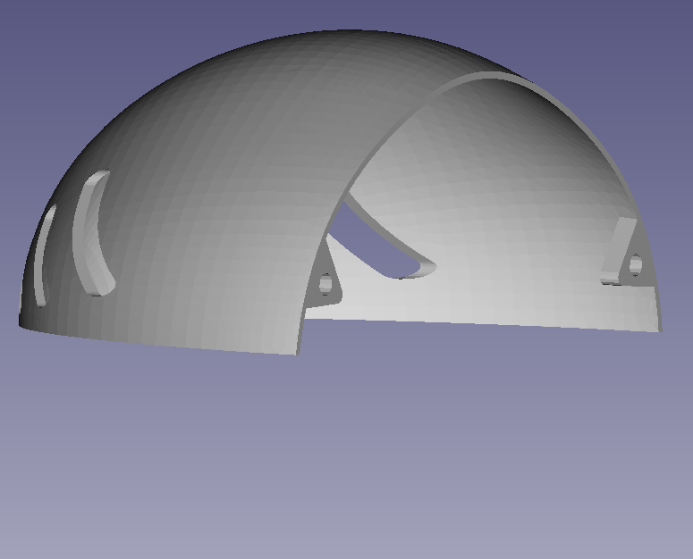
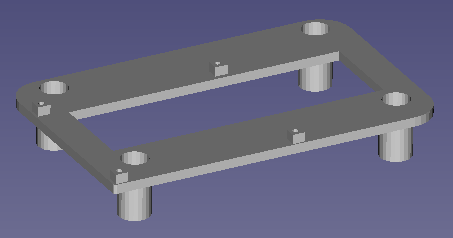

# BOM

For the head _eva_, you need the following material:

|  id   | description                                                                                                         | quantity |
| :---: | :------------------------------------------------------------------------------------------------------------------ | :------: |
|  1.1  | Raspberry Pi 4 module with its SD card                                                                              |    1     |
|  1.2  | Power cable  using  a 12 V -> 6 V converter                                                                         |    1     |
|  2.1  | 3.4 inch display 800x400                                                                                            |    1     |
|  2.2  | 20 cm FPC 15PIN (Flexible Printed Circuits, opposite sides) cable to connect the display to the DSI port of the RPi |    1     |
|   3   | Miniature RPi camera B0066                                                                                          |    1     |
|   4   | Miniature button magnets                                                                                            |    4     |
|  5.1  | Front-bottom part of the head (3D printed)                                                                          |    1     |
|  5.2  | Top part of the head (3D printed)                                                                                   |    1     |
|  5.3  | RPi 4 support part (3D printed)                                                                                     |    1     |
|  5.4  | Locking brackets (3D printed) to lock the display in the head                                                       |    2     |
|  6.1  | M2x6 screws                                                                                                         |    16    |
|  6.2  | M2 nuts                                                                                                             |    8     |
|   7   | _glue pads_ (yellow Patafix) to maintain the locking brackets on the display.                                       |    2     |

## 1/ Raspberry Pi 4 module

- You need a RPi4 module, with at least 2 GB RAM and a 16 GB SD card.

- In order to use the robot with the RPi4 the SD card must have a Linux OS and the Poppy software installed.

- To power the RPi4 from the 12 V power unit used for the robot motors, you must use a 12 V -> 5 V, 3A  converter like [this one available at generation robot](https://www.generationrobots.com/fr/402297-convertisseur-abaisseur-de-type-buck-ubec-dcdc-5v-3a-output.html). 

## 2/ 4.3inch Capacitive Touch Display, DSI Interface, 800×480

We have selected [this display](https://www.waveshare.com/product/raspberry-pi/displays/lcd-oled/4.3inch-dsi-lcd.htm?):

- Compatible with the DSI display interface of the Raspberry Pi.
- Resolution of 800x400 with touch control.
- Relatively cheap (~ 40 $ or 36 €).

As shown on the image, the RPi module can be attached directly to the back of the display, but for the Poppy usage, the display will be connected to the DSI connector using a 25 cm long FPC 15PIN (Flexible Printed Circuits, opposite sides).

The display is available for example from [www.waveshare.com](https://www.waveshare.com/product/raspberry-pi/displays/lcd-oled/4.3inch-dsi-lcd.htm?), and the flat flexibal cable is available for example from [FARNEL](https://www.newark.com/multicomp-pro/mp-ffca10152003b/cable-assy-ffc-ffc-15-core-200mm/dp/67AH2982?ost=3385343).

## 3/ Miniature camera 5 Mpx B0066

We have choosen [this model](https://www.arducam.com/spy-camera-raspberry-pi/) for its very small size and good technical characteristics. It is fuly compatible with the camera connector of the RPi module:

~ 35 € available for example at [www.generationrobots.com](https://www.generationrobots.com/en/402341-spy-camera-for-raspberry-pi.html), 
[www.gotronic.fr](https://www.gotronic.fr/art-module-camera-miniature-5-mpx-b0066-25255.htm) or [www.lextronic.fr](https://www.lextronic.fr/module-camera-spy-camera-5-mpx-pour-raspberry-pi-39137.html).

## 4/ Miniature button magnets

The button magnets are used for assembling the 2 parts of the head.
Dimensions:

- diameter: 6 mm
- thickness: 2.75 mm.

## 5/ STL parts

All the STL files are in the directory `STL`.

- the head is divided in 2 parts fixed with the miniature magnets :
  - the front/bottom part: 
`eva_head_frontBottom-part.stl` 

  
  - the top part: 
`eva_head_top-part.stl` 

- the RPi4 support inserted in the frontBottom part: 
`eva_head_RPi4Support-part.stl` 

  
- two "locking bracket" parts are used to lock the display in the head: 
`eva_head_lock-part.stl` 

